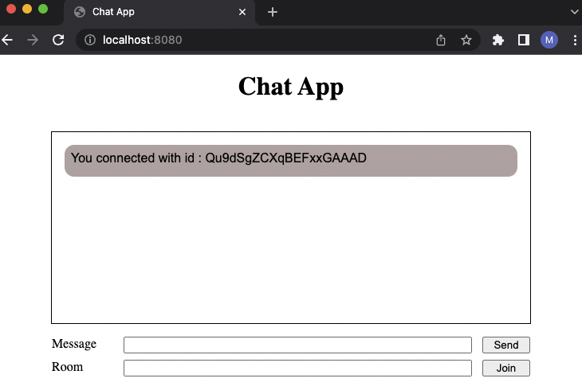

# A chat application using socket.io

## Includes a feature such as creating and joining a room

## Server Side
### Socket.io 
Run `npm install` and then run `npm run dev` to start the server

## Client Side
### Snowpack
Run `npm install` and then run `npm run start` and open localhost:8080

### Start Chatting
Enter id in room

## Screenshots

